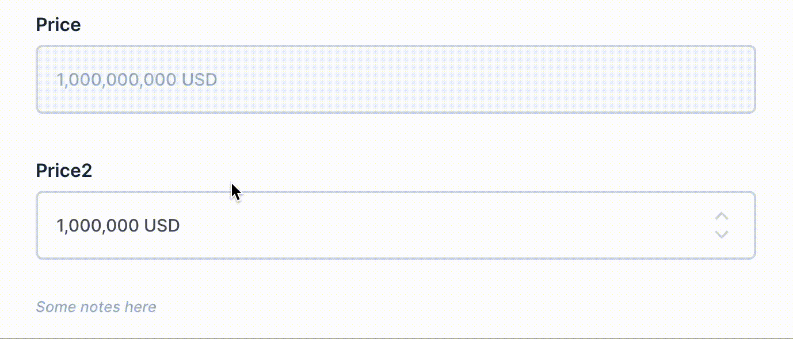

[](https://badge.fury.io/js/directus-extension-brl-interface)

# Introduction

A [Directus](https://github.com/directus/directus) interface extension that displays brazilian currency value properly.



# Installation

```
npm i directus-extension-brl-interface
```

# Get Started

1. Go to **Settings**, create a new field with type string or number.
2. In the **Interface** panel, choose **Currency** interface. There are 2 options:
   1. **Prefix**: A string that will be prepended to the formatted value.
   2. **Suffix**: A string that will be appended to the formatted value.
